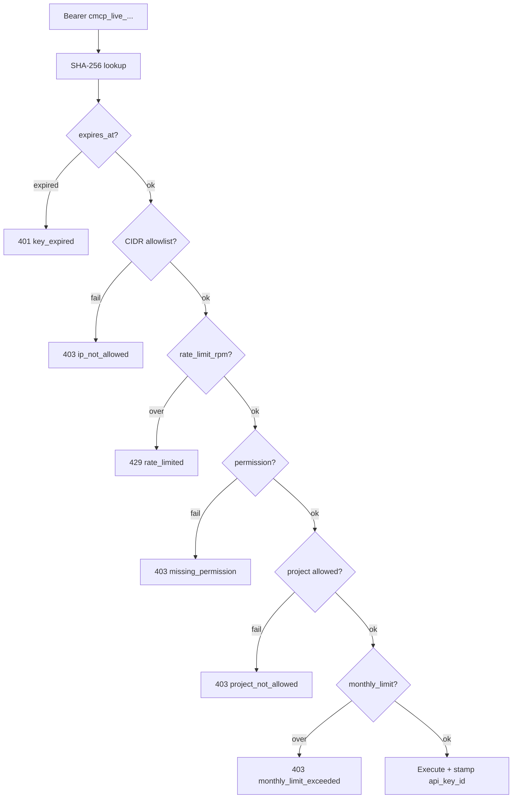

Workspace members create their own `cmcp_live_...` keys for pipelines, SDKs, and MCP. Each key can carry **conditions** that limit what it can do.

Manage keys in the dashboard (**Connect → API keys**) or via the [API keys reference](/api-reference/api-keys).

## Why conditions

| Use case | Typical conditions |
|----------|-------------------|
| CI for one project | `project_id` + `log_usage` + `read_summaries` |
| Shared ingest with a budget | `monthly_limit` |
| Temporary contractor key | `expires_at` |
| Locked-down server | `allowed_cidrs` + `rate_limit_rpm` |

## Create a key (dashboard)

1. Open `https://costmcp.com` → your workspace → **Connect**
2. Under **API keys**, set:
   - **Name**
   - **Permissions** (checkboxes)
   - **Project scope** (all projects or one)
   - **Monthly limit (USD)** (optional)
   - **Expires** (optional)
   - **Advanced:** rate limit, CIDR allowlist, live/test
3. Click **Create key** and **copy the secret once**

Rotate or edit conditions later without recreating the key (rotate issues a new secret; edit does not).

## Create a key (API)

```bash
curl -X POST https://api.costmcp.com/api/v1/workspaces/acme-ai/api-keys \
  -H "Authorization: Bearer $SUPABASE_ACCESS_TOKEN" \
  -H "Content-Type: application/json" \
  -d '{
    "name": "Slideshow CI",
    "permissions": ["log_usage", "read_summaries"],
    "monthly_limit": 75,
    "rate_limit_rpm": 120,
    "expires_at": "2026-12-31T23:59:59Z"
  }'
```

Response includes `secret` (`cmcp_live_...`) **once**. Store it as `COSTMCP_API_KEY` in your pipeline.

## Condition reference

| Field | Effect |
|-------|--------|
| `permissions[]` | Capability allow-list — see [Permissions](/concepts/permissions) |
| `project_id` | Key may only touch that project (writes + reads) |
| `conditions.project_slugs` | Multi-project allow-list (ignored if `project_id` is set) |
| `conditions.deny_project_slugs` | Deny-list when no allow-list |
| `conditions.features` | Restrict usage `feature` strings |
| `conditions.sources` | Restrict `api` / `mcp` / `manual` / `import` |
| `monthly_limit` | Max USD attributed to this key in the current UTC month |
| `expires_at` | Hard stop — `401 key_expired` |
| `rate_limit_rpm` | Rolling 60s window — `429 rate_limited` |
| `allowed_cidrs` | Empty = all IPs; otherwise `403 ip_not_allowed` |
| `environment` | `live` (default) or `test` |

First-class columns win over JSON when both apply (`project_id` over `project_slugs`).

## How enforcement works



Same checks apply to REST ingest/read routes and [`https://mcp.costmcp.com`](/mcp/remote-http).

### Error shape

```json
{
  "error": "monthly_limit_exceeded",
  "error_description": "Key monthly_limit of 50.00 USD exceeded",
  "limit_usd": 50,
  "spent_usd": 52.1
}
```

## Use the key

### REST

```bash
export COSTMCP_API_KEY=cmcp_live_...
curl -X POST https://api.costmcp.com/api/v1/messages \
  -H "Authorization: Bearer $COSTMCP_API_KEY" \
  -H "Content-Type: application/json" \
  -d '{ "project": "slideshow-studio", "source": "api", "message": { "type": "usage", "provider": "openai", "unit_type": "image", "quantity": 1, "estimated_cost": 0.04 } }'
```

### Remote MCP (API key bridge)

```json
{
  "mcpServers": {
    "costmcp": {
      "command": "npx",
      "args": [
        "-y",
        "mcp-remote",
        "https://mcp.costmcp.com",
        "--header",
        "Authorization: Bearer cmcp_live_..."
      ]
    }
  }
}
```

Prefer OAuth for ChatGPT / Claude when possible — see [OAuth overview](/oauth/overview). Static keys are ideal for CI and servers.

## Rotate, edit, revoke

| Action | Endpoint / UI |
|--------|----------------|
| Edit conditions | Dashboard **Edit**, or `PATCH .../api-keys/{id}` |
| Rotate secret | Dashboard **Rotate**, or `POST .../api-keys/{id}/rotate` |
| Revoke | Dashboard **Revoke**, or `DELETE .../api-keys/{id}` |

Rotation invalidates the previous secret immediately. Conditions are preserved.

## Spend metering

Every successful ingest stamps `api_key_id` on the `cost_messages` row. The dashboard list shows **spent / monthly_limit** for the current UTC month. Only spend attributed to that key counts toward the cap.

## Production vs local env key

| Environment | `COSTMCP_API_KEY` env on the API process |
|-------------|------------------------------------------|
| Local / `NODE_ENV !== production` | Accepted as a demo-workspace fallback |
| Production | **Disabled** unless `COSTMCP_ALLOW_ENV_API_KEY=true` |

Always create a real dashboard key for production pipelines.

## Related

- [API keys reference](/api-reference/api-keys) — full request/response fields
- [Authentication](/concepts/authentication) — key vs JWT vs OAuth
- [Permissions](/concepts/permissions) — permission strings
- [Remote HTTP MCP](/mcp/remote-http) — agent URL `https://mcp.costmcp.com`
