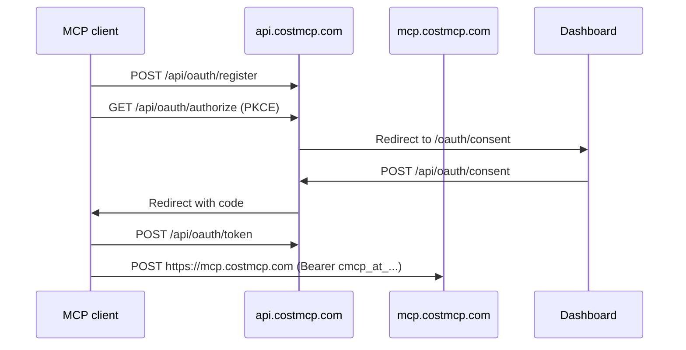

CostMCP splits roles across hosts: **authorization server** at `https://api.costmcp.com`, **MCP resource** at `https://mcp.costmcp.com`.

## Flow



## Token prefixes

| Prefix | Meaning |
|--------|---------|
| `cmcp_client_` | Client ID |
| `cmcp_secret_` | Client secret (confidential) |
| `cmcp_at_` | Access token (1h) |
| `cmcp_rt_` | Refresh token (30d) |

## Scopes

```
log_usage add_expenses read_summaries estimate_costs manage_projects manage_subscriptions manage_obligations
```

## Protected resource

`https://mcp.costmcp.com`

(Legacy: `https://api.costmcp.com/api/mcp` still works.)

Manage connections from the dashboard (**Connect**) or [Connections API](/api-reference/connections).
